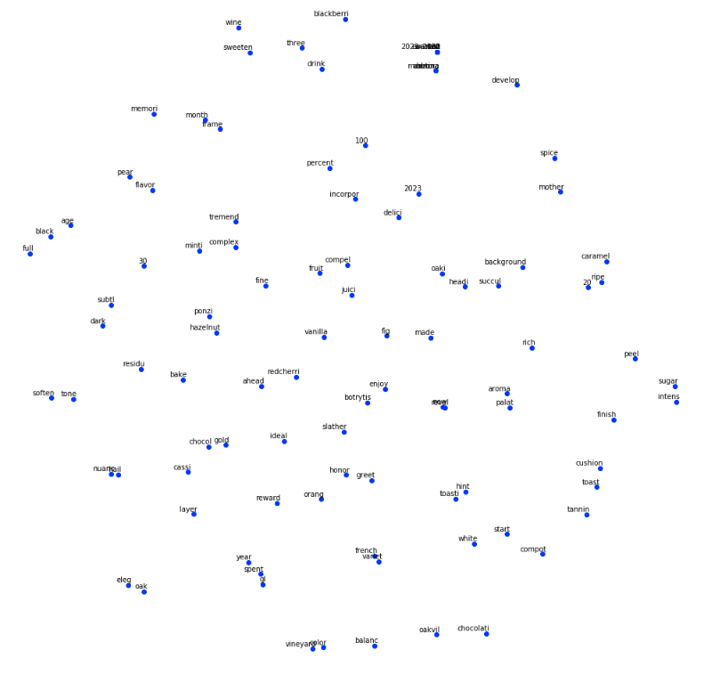
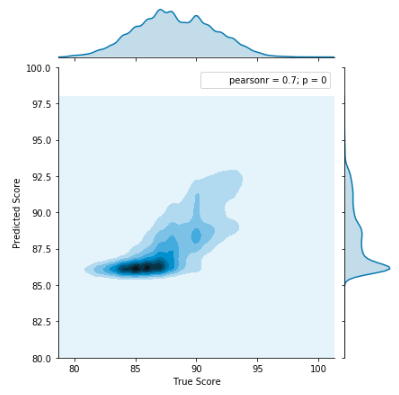

# NLP on Wine Reviews

## Objective

Predict the score of a wine review based purely on the textual features on the review.

## General Strategy

Use Word Embeddings and LSTM to extract as much semantic value from the reviews. The hypothesis is that semantically positive reviews will have higher ratings that semantically negative reviews.

Below table contains files of relevance.

| File  | Description  |
|---|---|
| [`EDA.ipynb`](https://github.com/johannesharmse/wine_nlp/blob/master/src/EDA/EDA.ipynb)  | Notebook containing the all code and process explanation.  |

## Credit

The following pages were used as inspiration for this project:

[Tensorflow Word2Vec Basic](https://github.com/tensorflow/tensorflow/blob/master/tensorflow/examples/tutorials/word2vec/word2vec_basic.py)

[O'Reilly - Perform sentiment analysis with LSTMs, using Tensorflow](https://www.oreilly.com/learning/perform-sentiment-analysis-with-lstms-using-tensorflow)